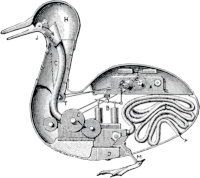

#+title: auto-opti
#+author: Anthony CAUMOND
# See full fledge org example here https://github.com/fniessen/refcard-org-mode/blob/master/README.org?plain=1

[[https://github.com/hephaistox/auto-core/actions/workflows/commit_validation.yml][https://github.com/hephaistox/auto-core/actions/workflows/commit_validation.yml/badge.svg]] [[https://github.com/hephaistox/auto-core/actions/workflows/deploy_clojar.yml][https://github.com/hephaistox/auto-core/actions/workflows/deploy_clojar.yml/badge.svg]] [[https://github.com/hephaistox/auto-core/actions/workflows/pages/pages-build-deployment][https://github.com/hephaistox/auto-core/actions/workflows/pages/pages-build-deployment/badge.svg]]

[[https://clojars.org/org.clojars.hephaistox/auto-opti][https://img.shields.io/clojars/v/org.clojars.hephaistox/auto-opti.svg]]

[[https://github.com/hephaistox/hephaistox/wiki][https://img.shields.io/badge/wiki-hephaistox-blue.svg]] [[https://github.com/hephaistox/auto-core/wiki][https://img.shields.io/badge/wiki-project-blue.svg]] [[https://github.com/hephaistox/auto-core/discussions][https://img.shields.io/badge/discussions-blue.svg]]
[[https://hephaistox.github.io/auto-opti/][https://img.shields.io/badge/api-blue.svg]]

`auto-opti` is about all core technical functionalities we may need to start a project.

#+BEGIN_QUOTE
If every tool, when ordered, or even of its own accord, could do the work that befits it, just as the creations of Daedalus moved of themselves, or the tripods of Hephaestus went of their own accord to their sacred work, if the shuttle would weave and the plectrum touch the lyre without a hand to guide them, master-craftsmen would have no need of assistants and masters no need of slaves ~ Aristotle, Politics 1253b
#+END_QUOTE

* Main features
- This project should be agnostic of any environment, so it should run on the following examples of technology: CLI, backend of web app, frontend of web app, Android frontend, Android backend, ...
- Create cljc versions of features which are not naturally behaving the same between clj and cljs: uuids,
- Data strucutre helpers : regular expression, strings, keywords, maps, sequences, uuids
- Logging in clj and cljs with a proxy from cljc
- Configuration management
- Translation

* LICENCE
See license information in [[LICENSE.md][Attribution-NonCommercial 4.0 International]]

Copyright © 2020-2024 Hephaistox
