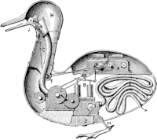

#+title: auto-opti
#+author: Anthony CAUMOND
# See full fledge org example here https://github.com/fniessen/refcard-org-mode/blob/master/README.org?plain=1

[[https://github.com/hephaistox/auto-core/actions/workflows/commit_validation.yml][https://github.com/hephaistox/auto-core/actions/workflows/commit_validation.yml/badge.svg]]  [[https://github.com/hephaistox/auto-core/actions/workflows/pages/pages-build-deployment][https://github.com/hephaistox/auto-core/actions/workflows/pages/pages-build-deployment/badge.svg]]

[[https://github.com/hephaistox/hephaistox/wiki][https://img.shields.io/badge/wiki-hephaistox-blue.svg]] [[https://github.com/hephaistox/auto-core/wiki][https://img.shields.io/badge/wiki-project-blue.svg]] [[https://github.com/hephaistox/auto-core/discussions][https://img.shields.io/badge/discussions-blue.svg]]
[[https://hephaistox.github.io/auto-opti/][https://img.shields.io/badge/api-blue.svg]]

#+BEGIN_QUOTE
If every tool, when ordered, or even of its own accord, could do the work that befits it, just as the creations of Daedalus moved of themselves, or the tripods of Hephaestus went of their own accord to their sacred work, if the shuttle would weave and the plectrum touch the lyre without a hand to guide them, master-craftsmen would have no need of assistants and masters no need of slaves ~ Aristotle, Politics 1253b
#+END_QUOTE

`auto-opti` provides features for simulation and optimization. The library is agnostic from any technoglogy.

* Definitions
Important definitions concerning simulation and optimization:
** System
The system is the part of the real life that the optimization is dealing with.
** Model
A model is a simplification of the system that is learning something useful from it, the model formalizes the system through its states and discrete events.
** Simulation
A simulation is a model that can evolve with time. It is often a software as it is easy to do in a computer program, but it is not limited to it.
* Motivations
Many libraries exist already for all features mentionned here, but:
- Specific features are missing like transformation, 
- Optimization should be agnostic of any execution environment (cli, backend, frontend, android, 32 vs 64 bits...)
- The assembly of all of that features is the responsability of the user, so it should not be done in advance. That said, assembly should be a no brainer and documented.
* Features
The libary is a collection of features that can be used independently one from each other, except for some cases where it is explicitly stated.
** [[file:docs/prng.org][Pseudo random number generator]]
Generate random numbers shaped for optimization.
** [[file:docs/distribution.org][Probability distribution]]
Leverage PRNG to create probabilistic distribution.
** [[file:docs/crit_comp.org][Criteria comparison]]
Compare two criteria to have informations on underneath solution performance.
** [[file:docs/eval.org][Evaluation]]
Evaluate a representation to obtain a solution
** Transformation
Hold, validate and execute the chain: representation -> evaluation -> solution -> criteria -> eval-crit
** [[file:docs/tb_var.org][Time based variable]]
Store data over time, with different storing strategy, and different semantics.
** [[file:docs/sample.org][Sample of data]]
Calculate statistics on a sample
** Time management
- Interface for time in optimization
- Implementation as Clojure date - [[https://github.com/dm3/clojure.java-time][See javatime]]
- Implementation as integer, one date is a bucket number
- Implementation as variable bucket management [different bucket size]
** Scenario management
- Scenario portfolio
- Scenario persistence
** Optimization runner
- Randomized setup - when some parameters of the optimization are random variable
- Multiple seed execution

* LICENCE
See license information in [[LICENSE.md][Attribution-NonCommercial 4.0 International]]

Copyright © 2020-2024 Hephaistox
